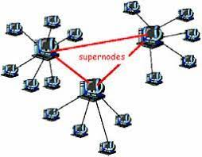
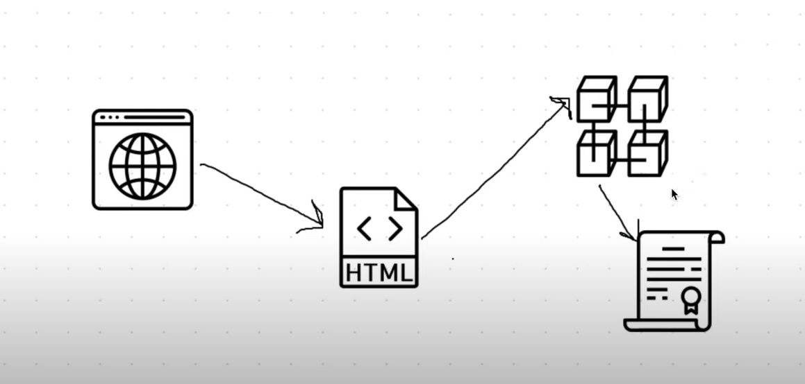
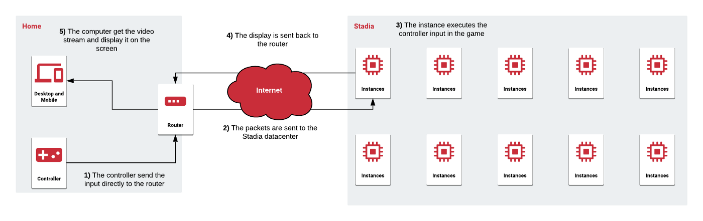
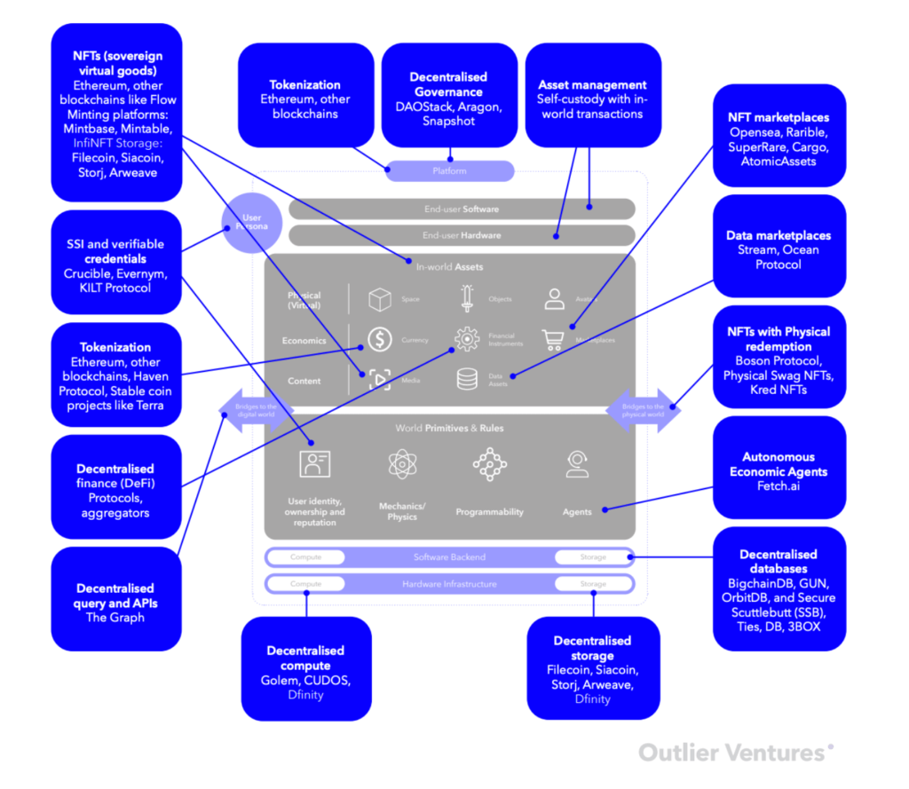

# OrientaVerso

## **FINTECH** & **BACKEND**

Nel repository sarà caricato ogni tipo di documento, inerente la ricerca per il progetto **OrientaVerso**

## **STRUTTURA**

Il repository sarà suddiviso in due aree:
* **FINTECH**, verrà caricato il contenuto inerente al percorso *FinTech Software Developer*
* **BACKEND**, verrà caricato il contenuto inerente al percorso *Backend System Integrator*  

## **BENCHMARK**

* NFT
* Token interno
* Wallet

# Cloud Gaming
* [Cloud game aws](https://aws.amazon.com/it/gametech/) 
# Blockchain
  * [Spiega in modo efficacie come funziona la blockchain](https://www.youtube.com/watch?v=sX25z_-zMgI&list=PLwQeV2FDlYkixpJaFuJeqORWUS2_SQ80w&index=2)
  * [Blockchain programmata con java](https://www.youtube.com/watch?v=X0v5fN9QPU8&list=PLwQeV2FDlYkixpJaFuJeqORWUS2_SQ80w&index=3)
  * [Programmare un gioco in Blockchain usando Ethereum, Solidity, Web3.js, Truffle](https://www.youtube.com/watch?v=x-6ruqmNS3o&list=PLwQeV2FDlYkixpJaFuJeqORWUS2_SQ80w&index=7)
# Rete decentralizzata?
  * [Spiega in modo efficace come funziona la rete peer to peer](https://www.youtube.com/watch?v=PN08dlKwfUE&list=PLwQeV2FDlYkixpJaFuJeqORWUS2_SQ80w&index=6&t=1s)
  * [Progetto protocollo P2P](https://slideplayer.it/slide/960200/)
  * [Pdf P2P](http://www.ce.uniroma2.it/courses/iw08/lucidi/P2P_4pp.pdf) 
  * [Telegram P2P vs Whatsapp Client-Server](http://www.icircle.it/crittografia-peer-to-peer-telegram-piu-sicura-whatsapp/)

# Struttura di un gioco multiplayer
* [Spiega in modo efficacie il perchè utilizzare una determinata architettura di gioco](https://www.youtube.com/watch?v=77vYKsXC4IE&list=PLwQeV2FDlYkixpJaFuJeqORWUS2_SQ80w&index=8)
* [Metverso per un Software Engineers](https://www.youtube.com/watch?v=gnlYZXuN2vU)
* [Live Unity, dati statistici su strutture real-time](https://www.youtube.com/watch?v=CuQF7hXlVyk)

# Metaverso
* [Cos'è il Metverso](https://www.youtube.com/watch?v=jAa3VsWwQdE)
* [Cos'è il Metaversi Pt.2](https://www.youtube.com/watch?v=e8C_C7wBE68)
* [Metaverso in Sandbox](https://www.youtube.com/watch?v=46_4KRTJZVU)
* [Metaverso in theNemesis.io](https://thenemesis.io/)

# Considerazioni

La build migliore in tempo e risorse è costruire l'intrefaccia con codice HTML5, per poi essere in grado di operare con il nativo, dunque con la possibilità di avre un usabilità dell'app su quasi tutti i diversi dispositivi es. Tv,Iphone,Android,Xbox,Playstation,Switch,Pc,Mac,Tablet etc.

Per avere un app più performate, opterei per dei server dedicati (onde evitare es. *migrazioni host* etc.). Ogni server formerà un nodo della rete peer-to-peer in modo da avere una rete decentralizzata. Per ovviare o prevenire problemi di attachi indesiderati implementerei una BlockChain. Ogni nodo così sarà sicuro e teoricamente, inviolabile.

Il metavreso sarà formato da uno spazio comune (sala principale) da cui si potrà accedere in modo tempestivo ad aree del Metaverso. Area ITS ICT Orientamento sarà formato da un appezzamento di terreno simile alla struttura reale. Nei pressi, vi saranno i banchetti rappresentativi di ogni percorso. Ogni percorso sarà organizzato dall'aziente ad essa essociata. Sarà inoltre possibile effetture laboratori e game, che avranno come premio NFT innediti.  

# Definizione concettuale

>@Andrea Caglioti, studente della Fondazione ITS per le Tecnologie della informazione e della comunicazione

