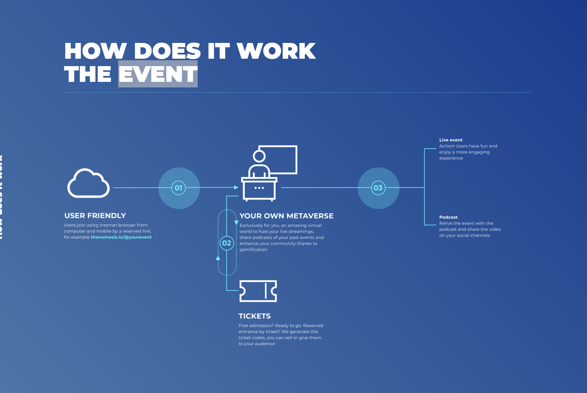
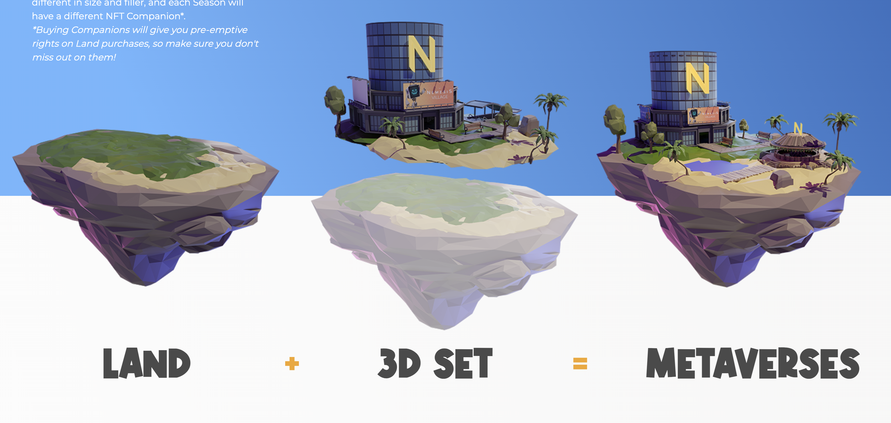
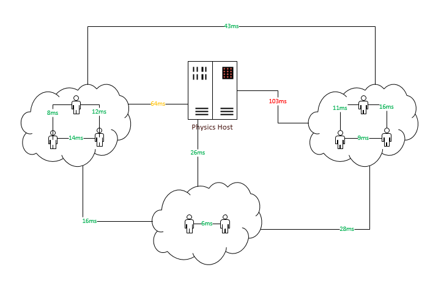
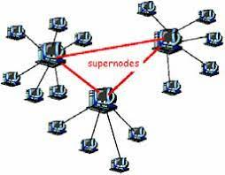
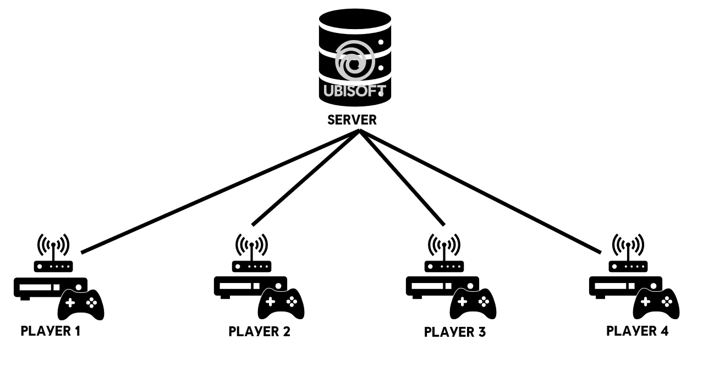
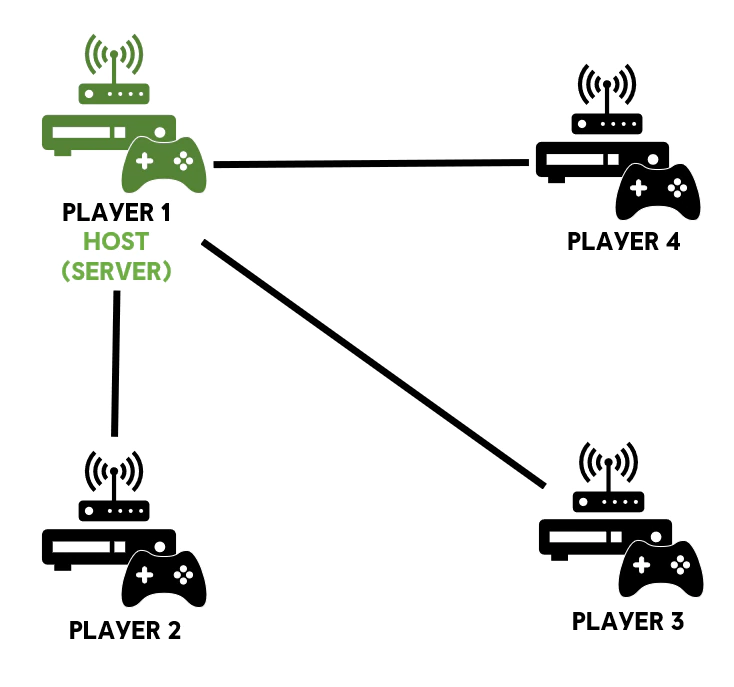
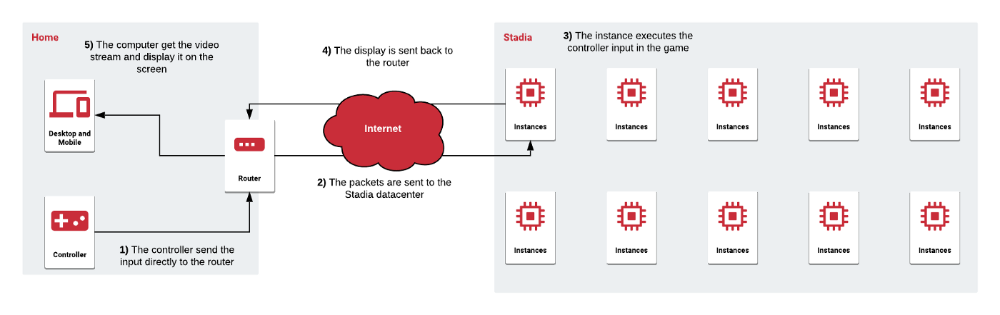
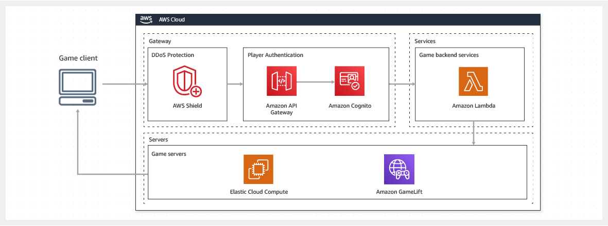
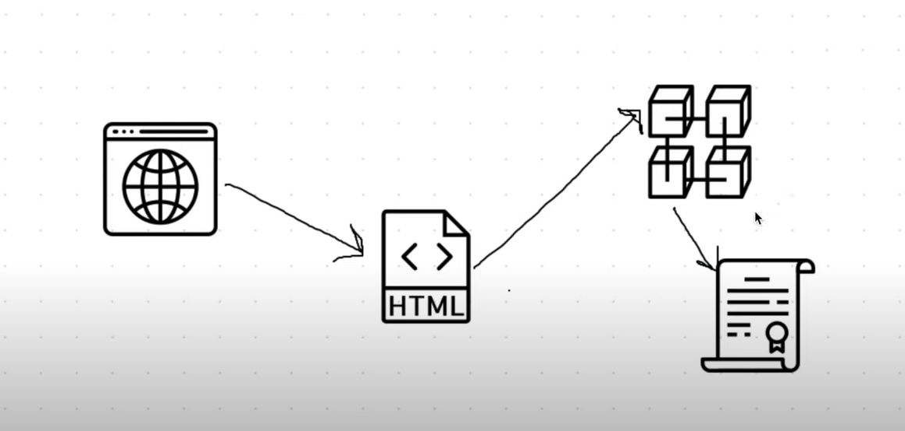
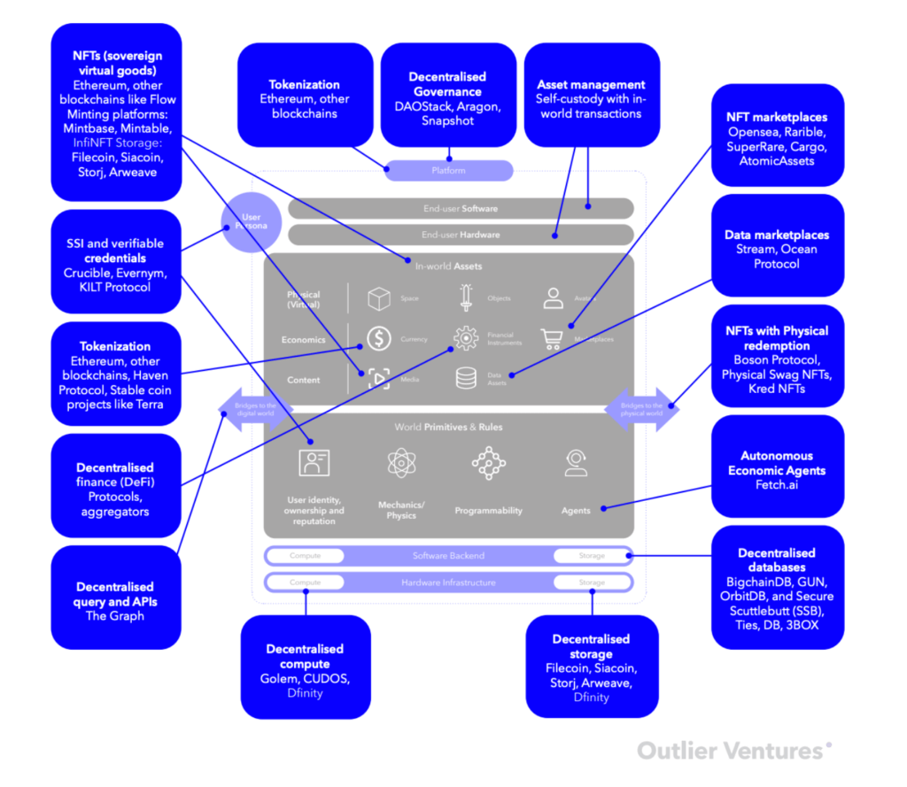

# OrientaVerso

## **FINTECH** & **BACKEND**

Nel repository sarà caricato ogni tipo di documento, inerente la ricerca per il progetto **OrientaVerso**

## **STRUTTURA**

Il repository sarà suddiviso in due aree:
* **FINTECH**, verrà caricato il contenuto inerente al percorso *FinTech Software Developer*
* **BACKEND**, verrà caricato il contenuto inerente al percorso *Backend System Integrator*  

## **BENCHMARK**
> * [The Sandbox (SAND), una ricerca di BINANCE](https://research.binance.com/en/projects/the-sandbox)  
Sandbox è un mondo virtuale costruito sulla **blockchain di Ethereum**, dove i giocatori possono costruire, possedere e monetizzare le proprie esperienze di gioco.   
Il token **SAND** è un token di utilità ERC-20 utilizzato per trasferimenti di valore, picchettamento e governance.
I prodotti attuali sulla piattaforma The Sandbox includono:  
**VoxEdit**: software per creare ASSETS voxel, che possono poi diventare Non-Fungible Token (NFT) ed essere importati nel Marketplace.  
**Marketplace**: un mercato decentralizzato per lo scambio di ATTIVITÀ di gioco creato in VoxEdit.  
**Game Maker**: uno strumento di scripting visivo che consente a chiunque di creare giochi 3D gratuitamente.

> * [theNemesis.io, il multiverso ad eventi](https://thenemesis.io/events)

> * [Destiny 2, Server Dedicati, Peer-to-Peer e Gestione di Rete](https://www.youtube.com/watch?v=Isk8fXuA6r0)

## **ARTICOLI**

## Cloud Gaming
* [Cloud game aws](https://aws.amazon.com/it/gametech/) 
* [How to use Google Cloud for Cloud Gaming](https://www.youtube.com/watch?v=bGNBnPSNa8c)

## Struttura di un gioco multiplayer
* [Spiega in modo efficacie il perchè utilizzare una determinata architettura di gioco](https://www.youtube.com/watch?v=77vYKsXC4IE&list=PLwQeV2FDlYkixpJaFuJeqORWUS2_SQ80w&index=8)
* [Metverso per un Software Engineers](https://www.youtube.com/watch?v=gnlYZXuN2vU)
* [Live Unity, dati statistici su strutture real-time](https://www.youtube.com/watch?v=CuQF7hXlVyk)

* [Ubisoft server dedicato](https://www.ubisoft.com/it-it/help/connectivity-and-performance/article/information-about-server-based-games-on-pc/000096214)

* [Ubisoft P2P](https://www.ubisoft.com/it-it/help/connectivity-and-performance/article/information-about-peer-to-peer-games-on-pc/000096213)

* [AWS Server Dedicati](https://aws.amazon.com/it/gamelift/)

## Rete decentralizzata?
  * [Spiega in modo efficace come funziona la rete peer to peer](https://www.youtube.com/watch?v=PN08dlKwfUE&list=PLwQeV2FDlYkixpJaFuJeqORWUS2_SQ80w&index=6&t=1s)
  * [Progetto protocollo P2P](https://slideplayer.it/slide/960200/)
  * [Pdf P2P](http://www.ce.uniroma2.it/courses/iw08/lucidi/P2P_4pp.pdf) 
  * [Telegram P2P vs Whatsapp Client-Server](http://www.icircle.it/crittografia-peer-to-peer-telegram-piu-sicura-whatsapp/)

## Blockchain
  * [Spiega in modo efficacie come funziona la blockchain](https://www.youtube.com/watch?v=sX25z_-zMgI&list=PLwQeV2FDlYkixpJaFuJeqORWUS2_SQ80w&index=2)
  * [Blockchain programmata con java](https://www.youtube.com/watch?v=X0v5fN9QPU8&list=PLwQeV2FDlYkixpJaFuJeqORWUS2_SQ80w&index=3)
  * [Programmare un gioco in Blockchain usando Ethereum, Solidity, Web3.js, Truffle](https://www.youtube.com/watch?v=x-6ruqmNS3o&list=PLwQeV2FDlYkixpJaFuJeqORWUS2_SQ80w&index=7)
  * [Flow, new blockchain](https://www.onflow.org/)  
## Metaverso
* [Cos'è il Metverso](https://www.youtube.com/watch?v=jAa3VsWwQdE)
* [Cos'è il Metaversi Pt.2](https://www.youtube.com/watch?v=e8C_C7wBE68)
* [Metaverso in Sandbox](https://www.youtube.com/watch?v=46_4KRTJZVU)
* [Metaverso in theNemesis.io](https://thenemesis.io/)
* [Metavero nel Gaming](https://www.youtube.com/watch?v=hDhtIljOhoM)

## Linguaggi di programmazione
* [Lua, linguaggio di programmazione per creazioni mondi Roblox](https://developer.roblox.com/en-us/learn-roblox/coding-scripts)

## Definizione concettuale e immagini

# **Considerazione personale**

L'utente sarà reindirizzato su server remoti con hardware dedicato, che gli permetteranno di eseguire il gioco in remoto da cloud. 

Per avere un app più performate, opterei per dei server dedicati (onde evitare es. *migrazioni host* etc.). Ogni server formerà un nodo della rete peer-to-peer in modo da avere una rete decentralizzata.

L'immersività dell'esplorazione sarà frutto di immagini qualitative, di esperienze fluide all'interno del Metaverso e di un maggior coinvolgimento, soddisfando le curiosità e le esigenze dell'utente partecipante.

Il metaverso sarà formato da uno spazio comune (sala principale) da cui si potrà accedere in modo tempestivo ad aree del Metaverso. Area ITS ICT Orientamento sarà formato da un appezzamento di terreno simile alla struttura reale. Nei pressi, vi saranno i banchetti rappresentativi di ogni percorso. Ogni percorso sarà organizzato dall'aziente ad essa essociata. Le aziende si dovranno sfidare nel creare lo stand migliore, in modo tale da raggiungre più persone e ricevere un miglior feedback. Sarà inoltre possibile effetture laboratori e game, che avranno come ricompensa NFT inediti (**gadget**).  

>@Andrea Caglioti, studente della Fondazione ITS per le Tecnologie della informazione e della comunicazione

